# 计算机毕业设计一定要用springboot可以试试高校教师电子名片系统

<h4 style='color:red'>联系不到我，就看我的主页 </h4> 
 
#### 系统概要

毕业设计一定要用springboot框架来设计，可以试试基于Spring Boot的高校教师电子名片系统，它是一款专门为高校教师、学生和管理员设计的综合性平台，旨在提供便捷的电子名片管理、科研成果展示和公告发布等服务。系统分为管理端、学生端和老师端三种角色，每个角色拥有不同的功能模块，以满足其各自的需求。

#### 研究背景

信息数据从传统到当代，是一直在变革当中，突如其来的互联网让传统的信息管理看到了革命性的曙光，因为传统信息管理从时效性，还是安全性，还是可操作性等各个方面来讲，遇到了互联网时代才发现能补上自古以来的短板，有效的提升管理的效率和业务水平。传统的管理模式，时间越久管理的内容越多，也需要更多的人来对数据进行整理，并且数据的汇总查询方面效率也是极其的低下，并且数据安全方面永远不会保证安全性能。结合数据内容管理的种种缺点，在互联网时代都可以得到有效的补充。结合先进的互联网技术，开发符合需求的软件，让数据内容管理不管是从录入的及时性，查看的及时性还是汇总分析的及时性，都能让正确率达到最高，管理更加的科学和便捷。本次开发的高校教师电子名片系统实现了字典管理、公告管理、科研成果管理、科研成果收藏管理、名片管理、名片收藏管理、学生管理、教师管理、管理员管理等功能。系统用到了关系型数据库中王者MySql作为系统的数据库，有效的对数据进行安全的存储，有效的备份，对数据可靠性方面得到了保证。并且程序也具备程序需求的所有功能，使得操作性还是安全性都大大提高，让高校教师电子名片系统更能从理念走到现实，确确实实的让人们提升信息处理效率。

#### 技术栈

后端技术栈：Springboot+Mysql+Maven

前端技术栈：Vue+Html+Css+Javascript+ElementUI

开发工具：Idea+Vscode+Navicate

#### 系统功能介绍

管理端功能模块  
个人中心：管理员可以查看和管理个人信息，进行密码修改等操作，确保账户的安全性。  
基础数据管理：管理员可以管理系统的基础数据，包括学校的基本信息、学科分类、研究方向等。  
公告管理：管理员可以发布和管理系统内的各类公告信息，确保信息的及时传达。  
科研成果管理：管理员可以管理教师的科研成果信息，包括论文、专利、项目等，确保信息的完整性和准确性。  
名片管理：管理员可以管理教师的电子名片信息，便于信息的更新和维护。  
学生管理：管理员可以管理系统内的学生信息，包括学生的基本资料、课程信息等。  
教师管理：管理员可以管理教师的基本信息和教学资料，便于系统的统一管理。  
轮播图信息管理：管理员可以管理系统首页的轮播图信息，确保图片内容的更新和展示效果。  

学生端功能模块  
公告：学生可以查看系统内发布的各类公告信息，获取最新的通知和动态。  
科研成果：学生可以浏览教师的科研成果信息，了解最新的研究进展和学术动态。  
名片：学生可以查看和收藏教师的电子名片，便于联系和交流。  
个人中心：学生可以查看和管理个人信息，进行密码修改等操作，确保账户安全。  
后台管理：  
公告管理：学生可以在后台查看自己发布的公告信息。  
科研成果管理：学生可以管理自己收藏的科研成果信息。  
名片收藏管理：学生可以管理自己收藏的教师电子名片信息。  

老师端功能模块  
公告：教师可以查看和发布系统内的公告信息，便于通知学生和其他教师。  
科研成果：教师可以展示和管理自己的科研成果信息，包括论文、项目、专利等。  
名片：教师可以创建和更新自己的电子名片信息，便于学生和其他教师联系。  
个人中心：教师可以查看和管理个人信息，进行密码修改等操作，确保账户安全。  
后台管理：  
公告管理：教师可以管理自己发布的公告信息。  
科研成果管理：教师可以管理和展示自己的科研成果。  
名片管理：教师可以管理自己的电子名片信息，确保信息的准确性和时效性。  

#### 系统模块设计

高校教师电子名片系统系统在进行系统中功能模块的划分时，采用层次图来进行表示。层次图具有树形结构，它能使用矩形框来描绘数据信息。顶层代表的数据结构很完整，顶层下面的矩形框表示的数据就是子集数据，当然处于最下面的矩形框就是不能再进行细分的数据元素了，使用层次方框图描述系统功能能让用户一目了然，能够明白系统的功能，以及对应功能板块下面的子功能都可以清楚领会。高校教师电子名片系统分为管理员和用户两部分操作角色，下面将对他们的功能进行阐述。
管理员可以管理用户的基本信息，可以管理等功能。管理员功能结构图如下：

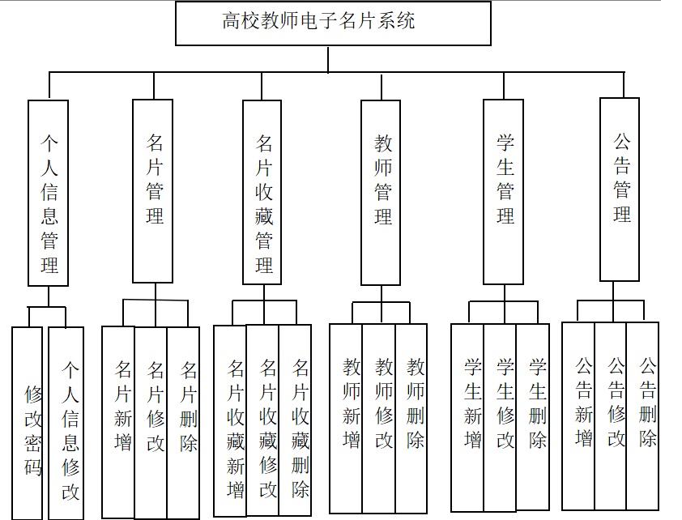

#### 系统流程分析

高校教师电子名片系统的开发也是有对应的流程，开发之前必须要进行用户功能需求的分析，最后根据功能需求进行网站设计还有数据库相关数据的设计工作，此次开发的高校教师电子名片系统开发流程如下：

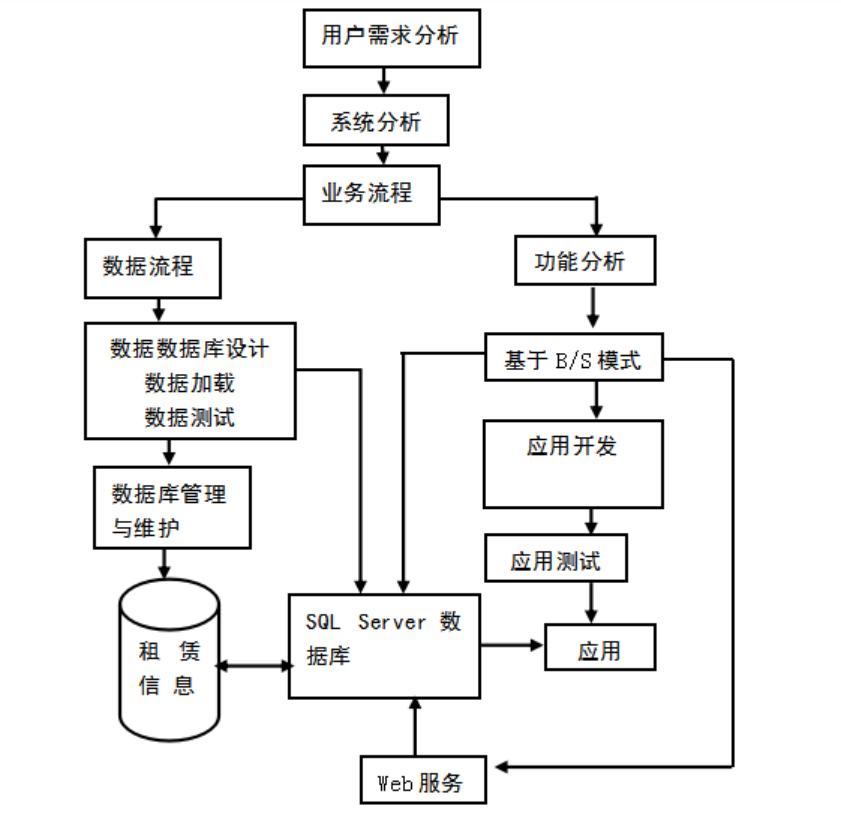

系统开发完成之后会给用户提供登录入口，在这个界面用户输入的信息会得到验证，通过验证之后才能进去高校教师电子名片系统的访问主界面，系统登录执行流程如下：

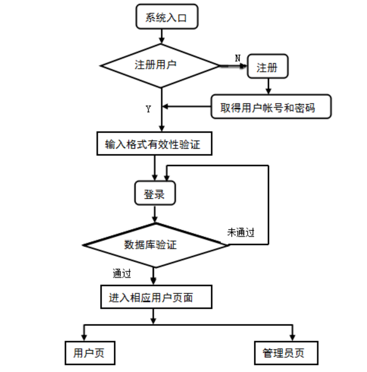

#### 系统作用

基于Spring Boot的高校教师电子名片系统在现代高校管理和教学中具有重要作用：

提升信息管理效率：系统通过信息化手段实现教师、学生和管理员之间的信息共享和管理，提高了信息的处理效率。  
促进学术交流与合作：通过电子名片和科研成果展示功能，教师和学生可以方便地获取对方的信息，促进学术交流与合作。  
增强信息透明度：系统内的公告和科研成果信息可以及时发布和更新，增强了信息的透明度和及时性。  
提高用户体验：系统界面友好、操作便捷，为用户提供了良好的使用体验，提高了用户的满意度。  

#### 系统功能截图

前台页面首页

公告模块

科研成果

名片模块

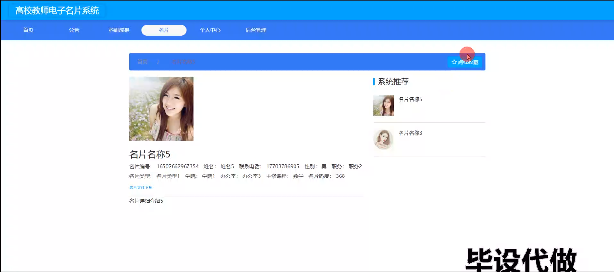

个人中心

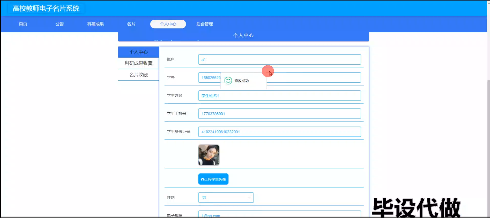

基础数据管理

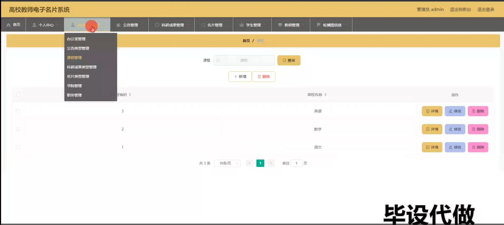

公告管理

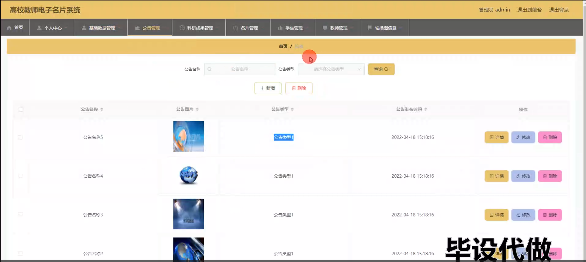

名片管理

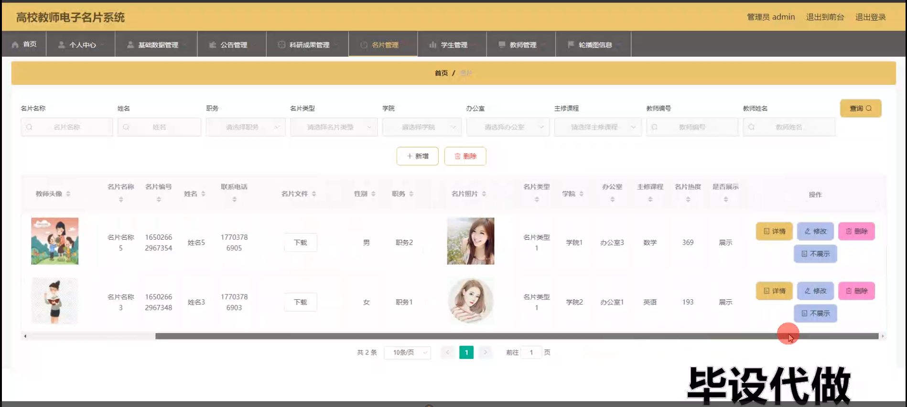

学生管理

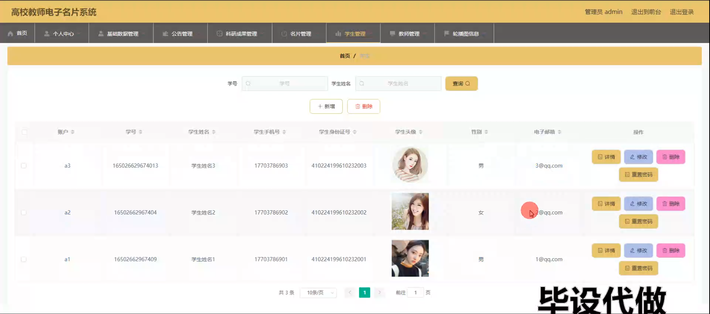

教师端后台管理

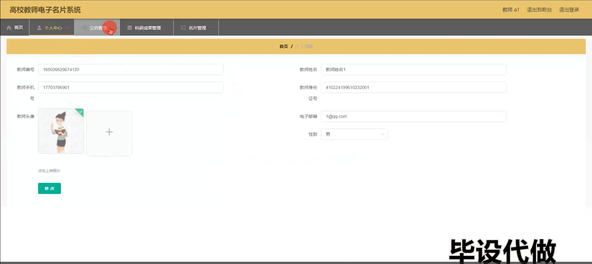

学生端后台管理

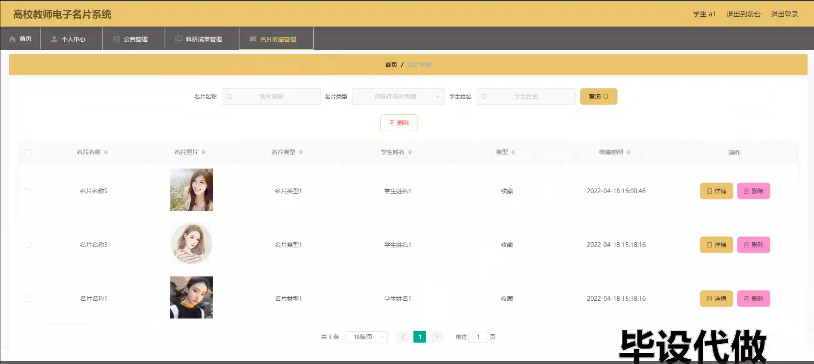

#### 总结

基于Spring Boot的高校教师电子名片系统通过多功能模块的设计和实现，有效地提升了高校信息管理的效率和服务水平，满足了教师、学生和管理员对信息化管理的需求。尽管系统在功能设计和用户体验方面已取得了一定的成效，但在信息安全、数据隐私保护等方面仍需进一步改进和优化。未来，可以结合大数据分析和人工智能技术，进一步提升系统的智能化水平，为高校的信息化管理提供更加全面和高效的解决方案。

#### 使用说明

创建数据库，执行数据库脚本 修改jdbc数据库连接参数 下载安装maven依赖jar 启动idea中的springboot项目

前台登录页面
http://localhost:8080/gaoxiaojiaoshidianzimingpian/front/index.html

后台登录页面
http://localhost:8080/gaoxiaojiaoshidianzimingpian/admin/dist/index.html

管理员				账户:admin 		密码：admin

学生				账户:a3 		密码：123456

教师				账户:a1 		密码：123456
